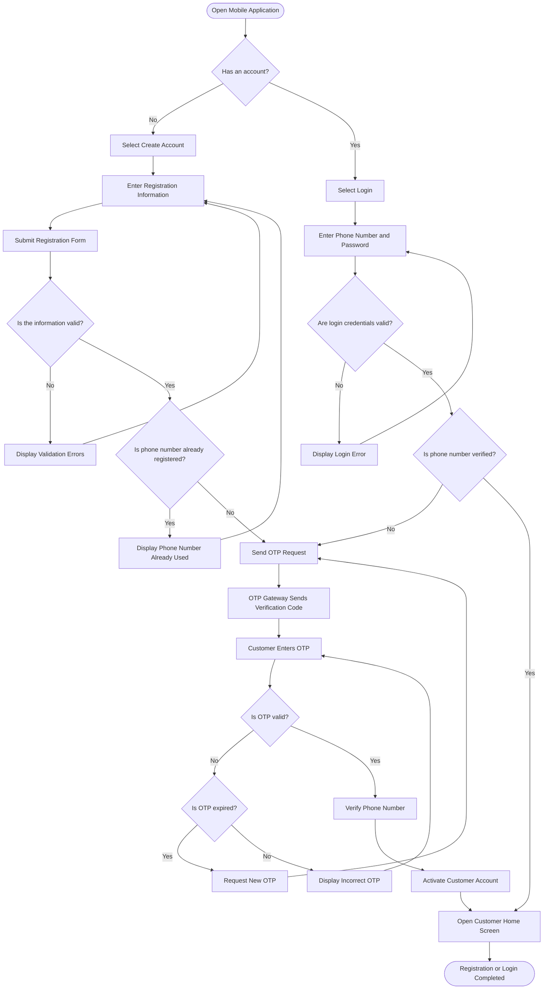

# Customer Registration & Login Flow

## Purpose

This document defines how a new Customer / One-Time Customer creates an account, verifies the phone number using OTP, and logs in to the mobile application.

---

## Actors

* Customer
* Mobile Application
* Backend System
* OTP / SMS Gateway

---

## Preconditions

* The customer has installed and opened the mobile application.
* The customer has a valid phone number.
* The phone number can receive SMS messages.

---

## Flow Diagram

---

## Main Registration Flow

1. The customer opens the mobile application.
2. The customer selects **Create Account**.
3. The customer enters the required registration information.
4. The system validates the entered information.
5. The system checks whether the phone number is already registered.
6. The system sends an OTP code to the customer’s phone number.
7. The customer enters the received OTP.
8. The system verifies the OTP.
9. The system activates the customer account.
10. The customer enters the application home screen.

---

## Main Login Flow

1. The customer opens the mobile application.
2. The customer selects **Login**.
3. The customer enters the phone number and password.
4. The system validates the login credentials.
5. The system confirms that the phone number is verified.
6. The customer enters the application home screen.

---

## Alternative Cases

### Invalid Registration Information

* The system displays validation errors.
* The customer corrects the information and submits the form again.

### Phone Number Already Registered

* The system informs the customer that the phone number is already in use.
* The customer can return to the Login screen.

### Incorrect OTP

* The system displays an incorrect OTP message.
* The customer can enter the code again.

### Expired OTP

* The customer requests a new OTP.
* The system sends a new verification code.

### Invalid Login Credentials

* The system displays a login error.
* The customer enters the phone number and password again.

### Unverified Account

* The system redirects the customer to the OTP verification process before allowing access.

---

## End Result

* The customer account is created and activated successfully, or
* An existing verified customer logs in successfully.
* The customer is redirected to the customer home screen.
