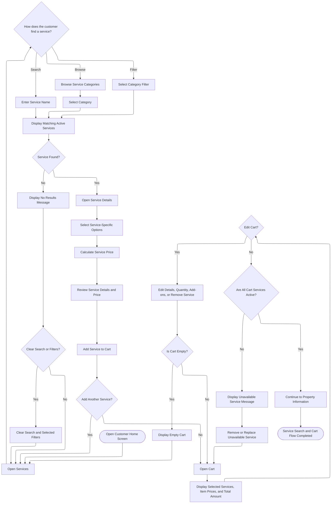

# Service Search & Cart Flow

```mermaid
---
config:
  layout: elk
---
flowchart TD
    A([Open Customer Home Screen]) --> B[Open Services]

    B --> C{How does the customer find a service?}

    C -- Search --> D[Enter Service Name]
    D --> E[Display Matching Active Services]

    C -- Browse --> F[Browse Service Categories]
    F --> G[Select Category]
    G --> E

    C -- Filter --> H[Select Category Filter]
    H --> E

    E --> I{Service Found?}

    I -- No --> J[Display No Results Message]
    J --> K{Clear Search or Filters?}

    K -- Yes --> L[Clear Search and Selected Filters]
    L --> B

    K -- No --> B

    I -- Yes --> M[Open Service Details]
    M --> N[Select Service-Specific Options]
    N --> O[Calculate Service Price]
    O --> P[Review Service Details and Price]
    P --> Q[Add Service to Cart]

    Q --> R{Add Another Service?}

    R -- Yes --> B
    R -- No --> S[Open Cart]

    S --> T[Display Selected Services, Item Prices, and Total Amount]
    T --> U{Edit Cart?}

    U -- Yes --> V[Edit Details, Quantity, Add-ons, or Remove Service]
    V --> W{Is Cart Empty?}

    W -- Yes --> X[Display Empty Cart]
    X --> B

    W -- No --> S

    U -- No --> Y{Are All Cart Services Active?}

    Y -- No --> Z[Display Unavailable Service Message]
    Z --> AA[Remove or Replace Unavailable Service]
    AA --> S

    Y -- Yes --> AB[Continue to Property Information]

    AB --> AC([Service Search and Cart Flow Completed])
```
