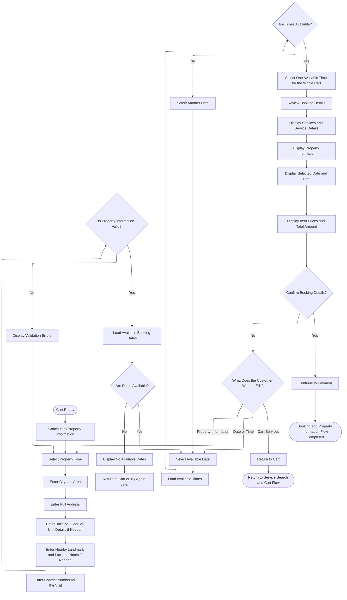

# Booking & Property Information Flow

```mermaid
---
config:
  layout: elk
---
flowchart TD
    A([Cart Ready]) --> B[Continue to Property Information]

    B --> C[Select Property Type]
    C --> D[Enter City and Area]
    D --> E[Enter Full Address]
    E --> F[Enter Building, Floor, or Unit Details if Needed]
    F --> G[Enter Nearby Landmark and Location Notes if Needed]
    G --> H[Enter Contact Number for the Visit]

    H --> I{Is Property Information Valid?}

    I -- No --> J[Display Validation Errors]
    J --> C

    I -- Yes --> K[Load Available Booking Dates]

    K --> L{Are Dates Available?}

    L -- No --> M[Display No Available Dates]
    M --> N[Return to Cart or Try Again Later]

    L -- Yes --> O[Select Available Date]
    O --> P[Load Available Times]

    P --> Q{Are Times Available?}

    Q -- No --> R[Select Another Date]
    R --> O

    Q -- Yes --> S[Select One Available Time for the Whole Cart]

    S --> T[Review Booking Details]

    T --> U[Display Services and Service Details]
    U --> V[Display Property Information]
    V --> W[Display Selected Date and Time]
    W --> X[Display Item Prices and Total Amount]

    X --> Y{Confirm Booking Details?}

    Y -- No --> Z{What Does the Customer Want to Edit?}

    Z -- Property Information --> C
    Z -- Date or Time --> O
    Z -- Cart Services --> AA[Return to Cart]
    AA --> AB([Return to Service Search and Cart Flow])

    Y -- Yes --> AC[Continue to Payment]

    AC --> AD([Booking and Property Information Flow Completed])
```
