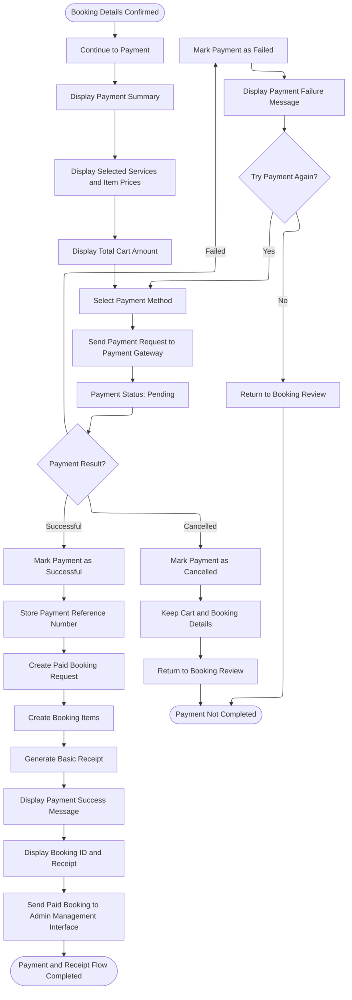

# Payment & Receipt Flow

```mermaid
---
config:
  layout: elk
---
flowchart TD
    A([Booking Details Confirmed]) --> B[Continue to Payment]

    B --> C[Display Payment Summary]
    C --> D[Display Selected Services and Item Prices]
    D --> E[Display Total Cart Amount]
    E --> F[Select Payment Method]

    F --> G[Send Payment Request to Payment Gateway]
    G --> H[Payment Status: Pending]
    H --> I{Payment Result?}

    I -- Successful --> J[Mark Payment as Successful]
    J --> K[Store Payment Reference Number]
    K --> L[Create Paid Booking Request]
    L --> M[Create Booking Items]
    M --> N[Generate Basic Receipt]
    N --> O[Display Payment Success Message]
    O --> P[Display Booking ID and Receipt]
    P --> Q[Send Paid Booking to Admin Management Interface]
    Q --> R([Payment and Receipt Flow Completed])

    I -- Failed --> S[Mark Payment as Failed]
    S --> T[Display Payment Failure Message]
    T --> U{Try Payment Again?}

    U -- Yes --> F
    U -- No --> V[Return to Booking Review]
    V --> W([Payment Not Completed])

    I -- Cancelled --> X[Mark Payment as Cancelled]
    X --> Y[Keep Cart and Booking Details]
    Y --> Z[Return to Booking Review]
    Z --> W
```
