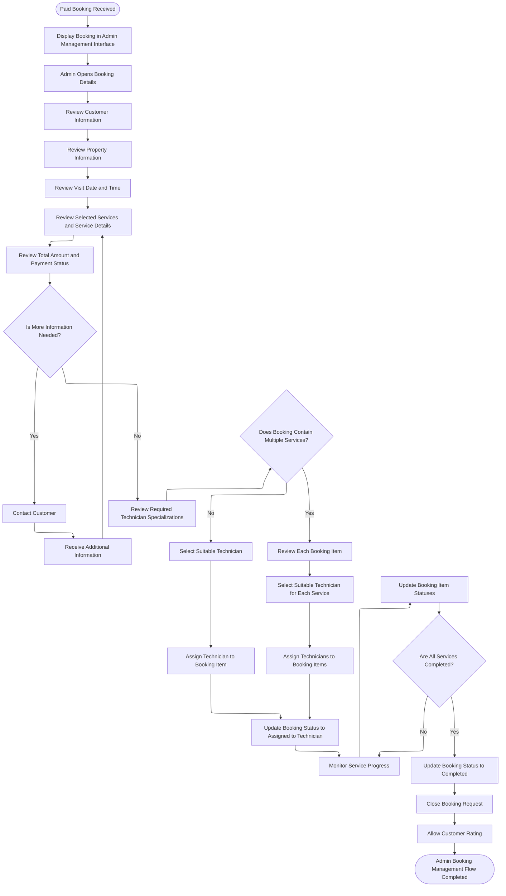

# Admin Booking Management Flow

```mermaid
---
config:
  layout: elk
---
flowchart TD
    A([Paid Booking Received]) --> B[Display Booking in Admin Management Interface]

    B --> C[Admin Opens Booking Details]
    C --> D[Review Customer Information]
    D --> E[Review Property Information]
    E --> F[Review Visit Date and Time]
    F --> G[Review Selected Services and Service Details]
    G --> H[Review Total Amount and Payment Status]

    H --> I{Is More Information Needed?}

    I -- Yes --> J[Contact Customer]
    J --> K[Receive Additional Information]
    K --> G

    I -- No --> L[Review Required Technician Specializations]

    L --> M{Does Booking Contain Multiple Services?}

    M -- No --> N[Select Suitable Technician]
    N --> O[Assign Technician to Booking Item]

    M -- Yes --> P[Review Each Booking Item]
    P --> Q[Select Suitable Technician for Each Service]
    Q --> R[Assign Technicians to Booking Items]

    O --> S[Update Booking Status to Assigned to Technician]
    R --> S

    S --> T[Monitor Service Progress]
    T --> U[Update Booking Item Statuses]

    U --> V{Are All Services Completed?}

    V -- No --> T

    V -- Yes --> W[Update Booking Status to Completed]
    W --> X[Close Booking Request]
    X --> Y[Allow Customer Rating]
    Y --> Z([Admin Booking Management Flow Completed])
```
