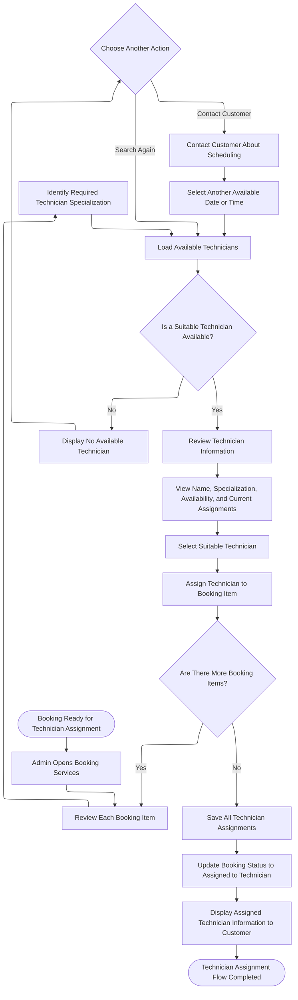

# Technician Assignment Flow

```mermaid
---
config:
  layout: elk
---
flowchart TD
    A([Booking Ready for Technician Assignment]) --> B[Admin Opens Booking Services]

    B --> C[Review Each Booking Item]
    C --> D[Identify Required Technician Specialization]
    D --> E[Load Available Technicians]

    E --> F{Is a Suitable Technician Available?}

    F -- No --> G[Display No Available Technician]
    G --> H{Choose Another Action}

    H -- Search Again --> E
    H -- Contact Customer --> I[Contact Customer About Scheduling]
    I --> J[Select Another Available Date or Time]
    J --> E

    F -- Yes --> K[Review Technician Information]
    K --> L[View Name, Specialization, Availability, and Current Assignments]
    L --> M[Select Suitable Technician]
    M --> N[Assign Technician to Booking Item]

    N --> O{Are There More Booking Items?}

    O -- Yes --> C
    O -- No --> P[Save All Technician Assignments]

    P --> Q[Update Booking Status to Assigned to Technician]
    Q --> R[Display Assigned Technician Information to Customer]
    R --> S([Technician Assignment Flow Completed])
```
