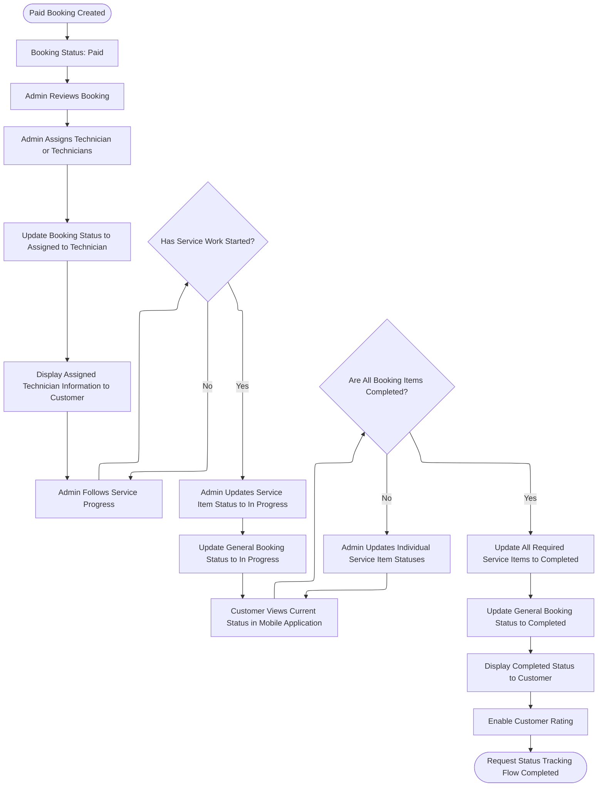

# Request Status Tracking Flow

```mermaid
---
config:
  layout: elk
---
flowchart TD
    A([Paid Booking Created]) --> B[Booking Status: Paid]

    B --> C[Admin Reviews Booking]
    C --> D[Admin Assigns Technician or Technicians]
    D --> E[Update Booking Status to Assigned to Technician]

    E --> F[Display Assigned Technician Information to Customer]
    F --> G[Admin Follows Service Progress]

    G --> H{Has Service Work Started?}

    H -- No --> G
    H -- Yes --> I[Admin Updates Service Item Status to In Progress]

    I --> J[Update General Booking Status to In Progress]
    J --> K[Customer Views Current Status in Mobile Application]

    K --> L{Are All Booking Items Completed?}

    L -- No --> M[Admin Updates Individual Service Item Statuses]
    M --> K

    L -- Yes --> N[Update All Required Service Items to Completed]
    N --> O[Update General Booking Status to Completed]
    O --> P[Display Completed Status to Customer]
    P --> Q[Enable Customer Rating]
    Q --> R([Request Status Tracking Flow Completed])
```
