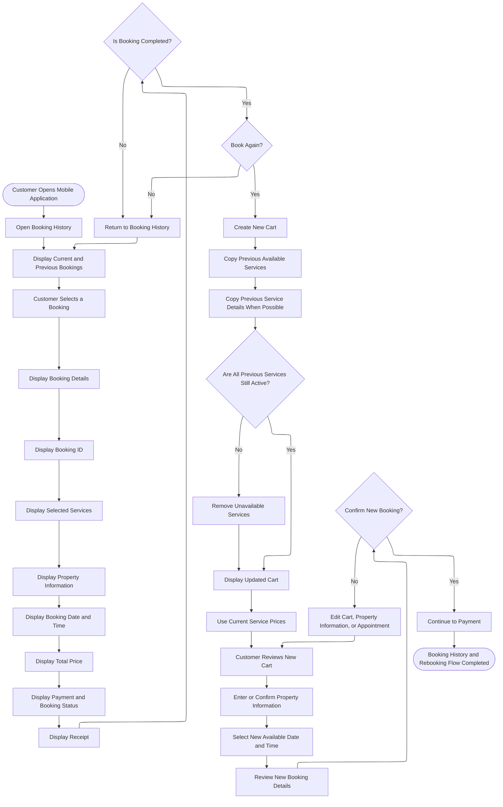

# Booking History & Rebooking Flow

```mermaid
---
config:
  layout: elk
---
flowchart TD
    A([Customer Opens Mobile Application]) --> B[Open Booking History]

    B --> C[Display Current and Previous Bookings]
    C --> D[Customer Selects a Booking]
    D --> E[Display Booking Details]

    E --> F[Display Booking ID]
    F --> G[Display Selected Services]
    G --> H[Display Property Information]
    H --> I[Display Booking Date and Time]
    I --> J[Display Total Price]
    J --> K[Display Payment and Booking Status]
    K --> L[Display Receipt]

    L --> M{Is Booking Completed?}

    M -- No --> N[Return to Booking History]
    N --> C

    M -- Yes --> O{Book Again?}

    O -- No --> N

    O -- Yes --> P[Create New Cart]
    P --> Q[Copy Previous Available Services]
    Q --> R[Copy Previous Service Details When Possible]

    R --> S{Are All Previous Services Still Active?}

    S -- No --> T[Remove Unavailable Services]
    T --> U[Display Updated Cart]

    S -- Yes --> U

    U --> V[Use Current Service Prices]
    V --> W[Customer Reviews New Cart]
    W --> X[Enter or Confirm Property Information]
    X --> Y[Select New Available Date and Time]
    Y --> Z[Review New Booking Details]

    Z --> AA{Confirm New Booking?}

    AA -- No --> AB[Edit Cart, Property Information, or Appointment]
    AB --> W

    AA -- Yes --> AC[Continue to Payment]
    AC --> AD([Booking History and Rebooking Flow Completed])
```
