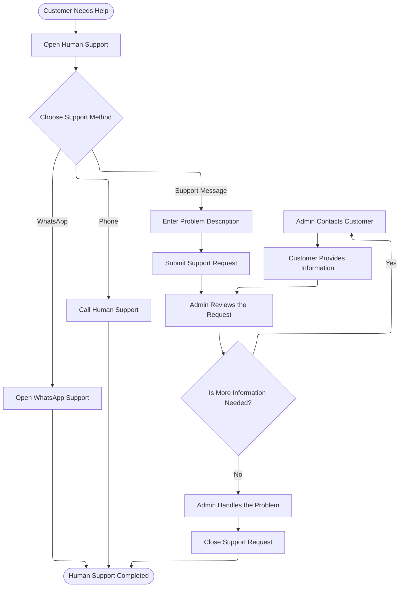

# Human Support Flow

```mermaid
---
config:
  layout: elk
---
flowchart TD
    A([Customer Needs Help]) --> B[Open Human Support]
    B --> C{Choose Support Method}

    C -- Phone --> D[Call Human Support]
    C -- WhatsApp --> E[Open WhatsApp Support]
    C -- Support Message --> F[Enter Problem Description]

    F --> G[Submit Support Request]
    G --> H[Admin Reviews the Request]
    H --> I{Is More Information Needed?}

    I -- Yes --> J[Admin Contacts Customer]
    J --> K[Customer Provides Information]
    K --> H

    I -- No --> L[Admin Handles the Problem]
    L --> M[Close Support Request]

    D --> N([Human Support Completed])
    E --> N
    M --> N
```
