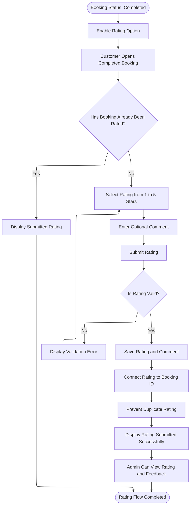

# Rating & Feedback Flow

```mermaid
---
config:
  layout: elk
---
flowchart TD
    A([Booking Status: Completed]) --> B[Enable Rating Option]

    B --> C[Customer Opens Completed Booking]
    C --> D{Has Booking Already Been Rated?}

    D -- Yes --> E[Display Submitted Rating]
    E --> F([Rating Flow Completed])

    D -- No --> G[Select Rating from 1 to 5 Stars]
    G --> H[Enter Optional Comment]
    H --> I[Submit Rating]

    I --> J{Is Rating Valid?}

    J -- No --> K[Display Validation Error]
    K --> G

    J -- Yes --> L[Save Rating and Comment]
    L --> M[Connect Rating to Booking ID]
    M --> N[Prevent Duplicate Rating]
    N --> O[Display Rating Submitted Successfully]
    O --> P[Admin Can View Rating and Feedback]
    P --> F
```
