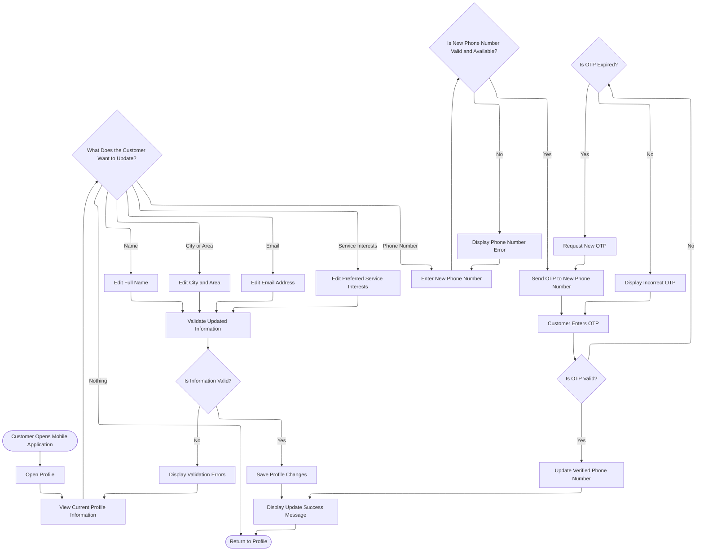

# Customer Profile Management Flow

```mermaid
---
config:
  layout: elk
---
flowchart TD
    A([Customer Opens Mobile Application]) --> B[Open Profile]
    B --> C[View Current Profile Information]
    C --> D{What Does the Customer Want to Update?}

    D -- Name --> E[Edit Full Name]
    D -- City or Area --> F[Edit City and Area]
    D -- Email --> G[Edit Email Address]
    D -- Service Interests --> H[Edit Preferred Service Interests]
    D -- Phone Number --> I[Enter New Phone Number]
    D -- Nothing --> J([Return to Profile])

    E --> K[Validate Updated Information]
    F --> K
    G --> K
    H --> K

    K --> L{Is Information Valid?}

    L -- No --> M[Display Validation Errors]
    M --> C

    L -- Yes --> N[Save Profile Changes]
    N --> O[Display Update Success Message]
    O --> J

    I --> P{Is New Phone Number Valid and Available?}

    P -- No --> Q[Display Phone Number Error]
    Q --> I

    P -- Yes --> R[Send OTP to New Phone Number]
    R --> S[Customer Enters OTP]
    S --> T{Is OTP Valid?}

    T -- No --> U{Is OTP Expired?}

    U -- Yes --> V[Request New OTP]
    V --> R

    U -- No --> W[Display Incorrect OTP]
    W --> S

    T -- Yes --> X[Update Verified Phone Number]
    X --> O
```
