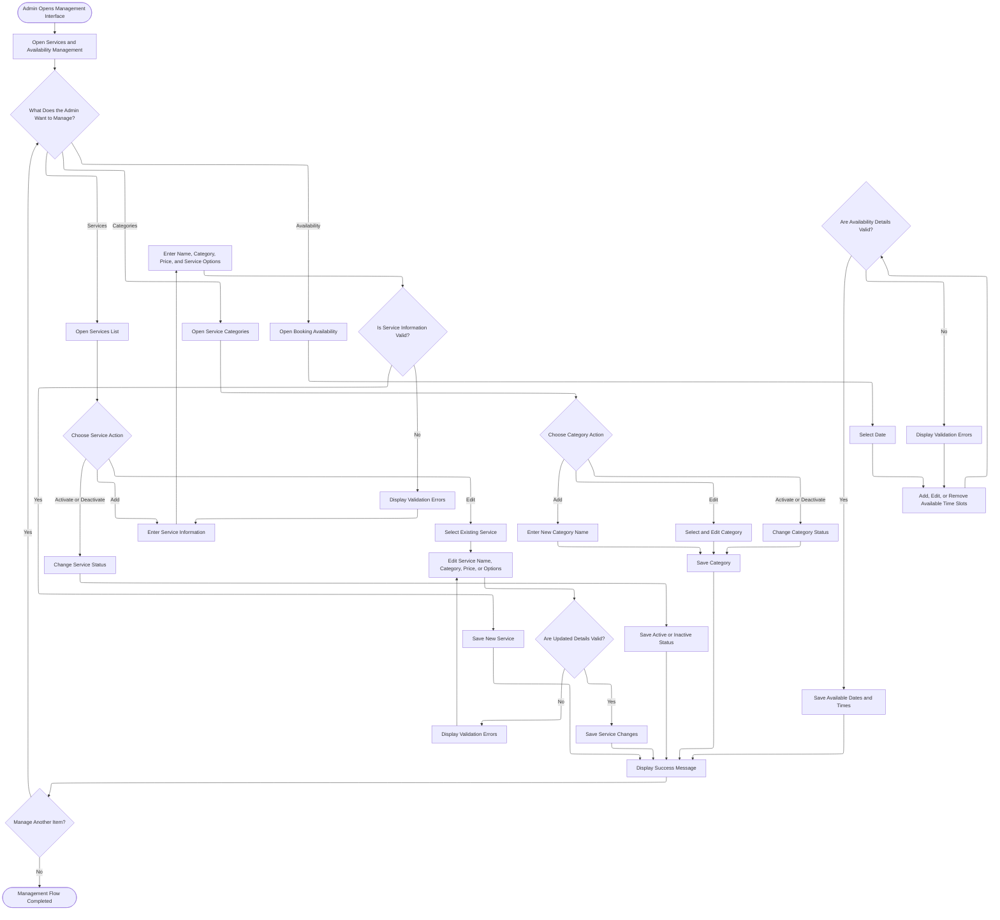

# Admin Services & Availability Management Flow

```mermaid
---
config:
  layout: elk
---
flowchart TD
    A([Admin Opens Management Interface]) --> B[Open Services and Availability Management]

    B --> C{What Does the Admin Want to Manage?}

    C -- Services --> D[Open Services List]
    C -- Categories --> E[Open Service Categories]
    C -- Availability --> F[Open Booking Availability]

    D --> G{Choose Service Action}

    G -- Add --> H[Enter Service Information]
    G -- Edit --> I[Select Existing Service]
    G -- Activate or Deactivate --> J[Change Service Status]

    H --> K[Enter Name, Category, Price, and Service Options]
    K --> L{Is Service Information Valid?}

    L -- No --> M[Display Validation Errors]
    M --> H

    L -- Yes --> N[Save New Service]
    N --> O[Display Success Message]

    I --> P[Edit Service Name, Category, Price, or Options]
    P --> Q{Are Updated Details Valid?}

    Q -- No --> R[Display Validation Errors]
    R --> P

    Q -- Yes --> S[Save Service Changes]
    S --> O

    J --> T[Save Active or Inactive Status]
    T --> O

    E --> U{Choose Category Action}

    U -- Add --> V[Enter New Category Name]
    U -- Edit --> W[Select and Edit Category]
    U -- Activate or Deactivate --> X[Change Category Status]

    V --> Y[Save Category]
    W --> Y
    X --> Y
    Y --> O

    F --> Z[Select Date]
    Z --> AA[Add, Edit, or Remove Available Time Slots]
    AA --> AB{Are Availability Details Valid?}

    AB -- No --> AC[Display Validation Errors]
    AC --> AA

    AB -- Yes --> AD[Save Available Dates and Times]
    AD --> O

    O --> AE{Manage Another Item?}

    AE -- Yes --> C
    AE -- No --> AF([Management Flow Completed])
```
