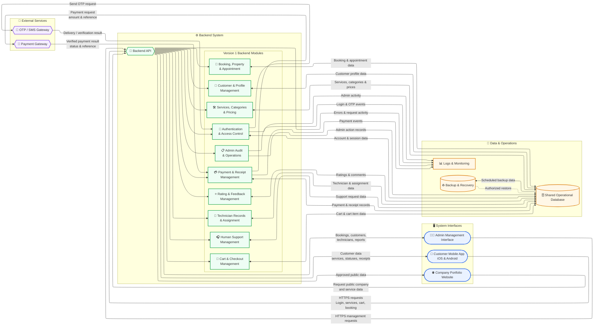
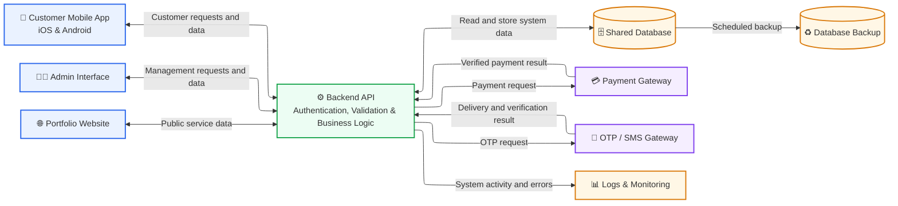

# System Architecture — Version 1

This document presents two architecture diagrams for Version 1 of the Smart Property Services Platform.

The first diagram is the **comprehensive architecture diagram**, which shows the internal Backend modules and detailed data flows.

The second diagram is the **simplified architecture diagram**, which shows only the main system components and their connections.

---

## 1. Comprehensive System Architecture

This is the more detailed architecture diagram. It shows the main system interfaces, Backend modules, external services, shared database, monitoring, and backup components.

---

## 2. Simplified System Architecture

This is the simpler architecture diagram. It shows only the main system interfaces, Backend API, shared database, external services, monitoring, and backup components.

